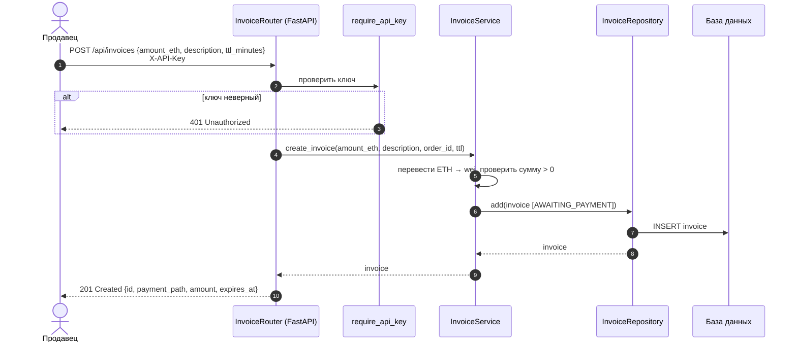
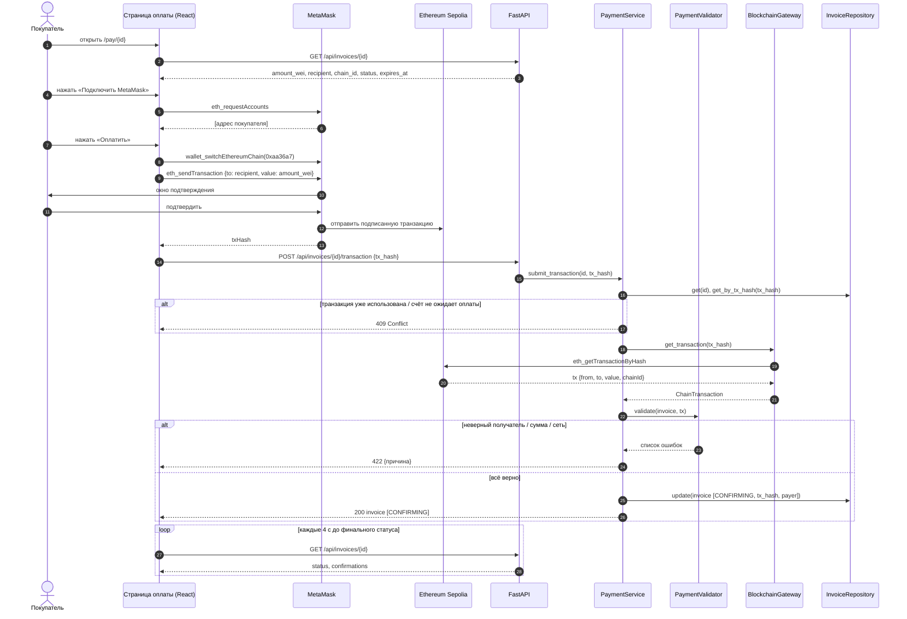
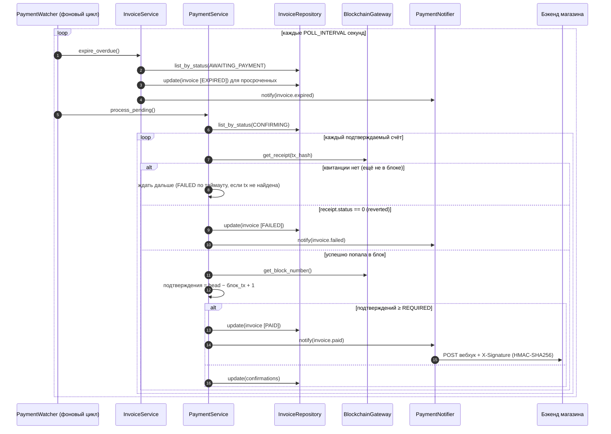

# 3. Диаграммы последовательности

## 3.1 Создание счёта (UC1)

```mermaid
sequenceDiagram
    autonumber
    actor M as Продавец
    participant API as InvoiceRouter (FastAPI)
    participant Auth as require_api_key
    participant IS as InvoiceService
    participant Repo as InvoiceRepository
    participant DB as База данных

    M->>API: POST /api/invoices {amount_eth, description, ttl_minutes}<br/>X-API-Key
    API->>Auth: проверить ключ
    alt ключ неверный
        Auth-->>M: 401 Unauthorized
    end
    API->>IS: create_invoice(amount_eth, description, order_id, ttl)
    IS->>IS: перевести ETH → wei, проверить сумму > 0
    IS->>Repo: add(invoice [AWAITING_PAYMENT])
    Repo->>DB: INSERT invoice
    Repo-->>IS: invoice
    IS-->>API: invoice
    API-->>M: 201 Created {id, payment_path, amount, expires_at}
```

## 3.2 Оплата счёта через MetaMask (UC3–UC6): основной сценарий

```mermaid
sequenceDiagram
    autonumber
    actor C as Покупатель
    participant UI as Страница оплаты (React)
    participant W as MetaMask
    participant Chain as Ethereum Sepolia
    participant API as FastAPI
    participant PS as PaymentService
    participant V as PaymentValidator
    participant BC as BlockchainGateway
    participant Repo as InvoiceRepository

    C->>UI: открыть /pay/{id}
    UI->>API: GET /api/invoices/{id}
    API-->>UI: amount_wei, recipient, chain_id, status, expires_at
    C->>UI: нажать «Подключить MetaMask»
    UI->>W: eth_requestAccounts
    W-->>UI: [адрес покупателя]
    C->>UI: нажать «Оплатить»
    UI->>W: wallet_switchEthereumChain(0xaa36a7)
    UI->>W: eth_sendTransaction {to: recipient, value: amount_wei}
    W->>C: окно подтверждения
    C->>W: подтвердить
    W->>Chain: отправить подписанную транзакцию
    W-->>UI: txHash
    UI->>API: POST /api/invoices/{id}/transaction {tx_hash}
    API->>PS: submit_transaction(id, tx_hash)
    PS->>Repo: get(id), get_by_tx_hash(tx_hash)
    alt транзакция уже использована / счёт не ожидает оплаты
        PS-->>UI: 409 Conflict
    end
    PS->>BC: get_transaction(tx_hash)
    BC->>Chain: eth_getTransactionByHash
    Chain-->>BC: tx {from, to, value, chainId}
    BC-->>PS: ChainTransaction
    PS->>V: validate(invoice, tx)
    alt неверный получатель / сумма / сеть
        V-->>PS: список ошибок
        PS-->>UI: 422 {причина}
    else всё верно
        PS->>Repo: update(invoice [CONFIRMING, tx_hash, payer])
        PS-->>UI: 200 invoice [CONFIRMING]
    end
    loop каждые 4 с до финального статуса
        UI->>API: GET /api/invoices/{id}
        API-->>UI: status, confirmations
    end
```

## 3.3 Отслеживание подтверждений фоновым процессом (UC7, UC9)

```mermaid
sequenceDiagram
    autonumber
    participant PW as PaymentWatcher (фоновый цикл)
    participant IS as InvoiceService
    participant PS as PaymentService
    participant Repo as InvoiceRepository
    participant BC as BlockchainGateway
    participant N as PaymentNotifier
    participant MB as Бэкенд магазина

    loop каждые POLL_INTERVAL секунд
        PW->>IS: expire_overdue()
        IS->>Repo: list_by_status(AWAITING_PAYMENT)
        IS->>Repo: update(invoice [EXPIRED]) для просроченных
        IS->>N: notify(invoice.expired)

        PW->>PS: process_pending()
        PS->>Repo: list_by_status(CONFIRMING)
        loop каждый подтверждаемый счёт
            PS->>BC: get_receipt(tx_hash)
            alt квитанции нет (ещё не в блоке)
                PS->>PS: ждать дальше (FAILED по таймауту, если tx не найдена)
            else receipt.status == 0 (reverted)
                PS->>Repo: update(invoice [FAILED])
                PS->>N: notify(invoice.failed)
            else успешно попала в блок
                PS->>BC: get_block_number()
                PS->>PS: подтверждения = head − блок_tx + 1
                alt подтверждений ≥ REQUIRED
                    PS->>Repo: update(invoice [PAID])
                    PS->>N: notify(invoice.paid)
                    N->>MB: POST вебхук + X-Signature (HMAC-SHA256)
                else
                    PS->>Repo: update(confirmations)
                end
            end
        end
    end
```
